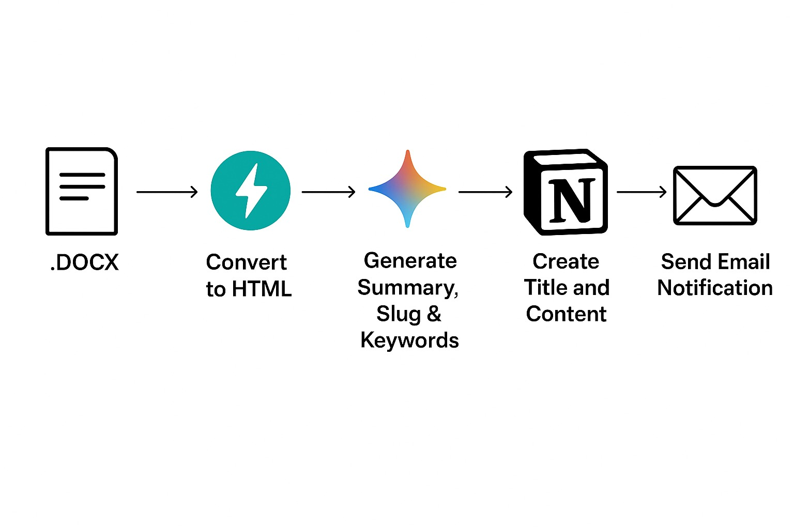

# RILA AI Agent



## Install virtual environment

```shell
python3 -m venv .venv
source .venv/bin/activate
```

Use ```which python``` to see if you are running the python version inside the venv folder.

## Install requirements

```shell
pip3 install -r requirements.txt
```

## Run the app

```shell
python -m uvicorn app.app:app --reload
```
